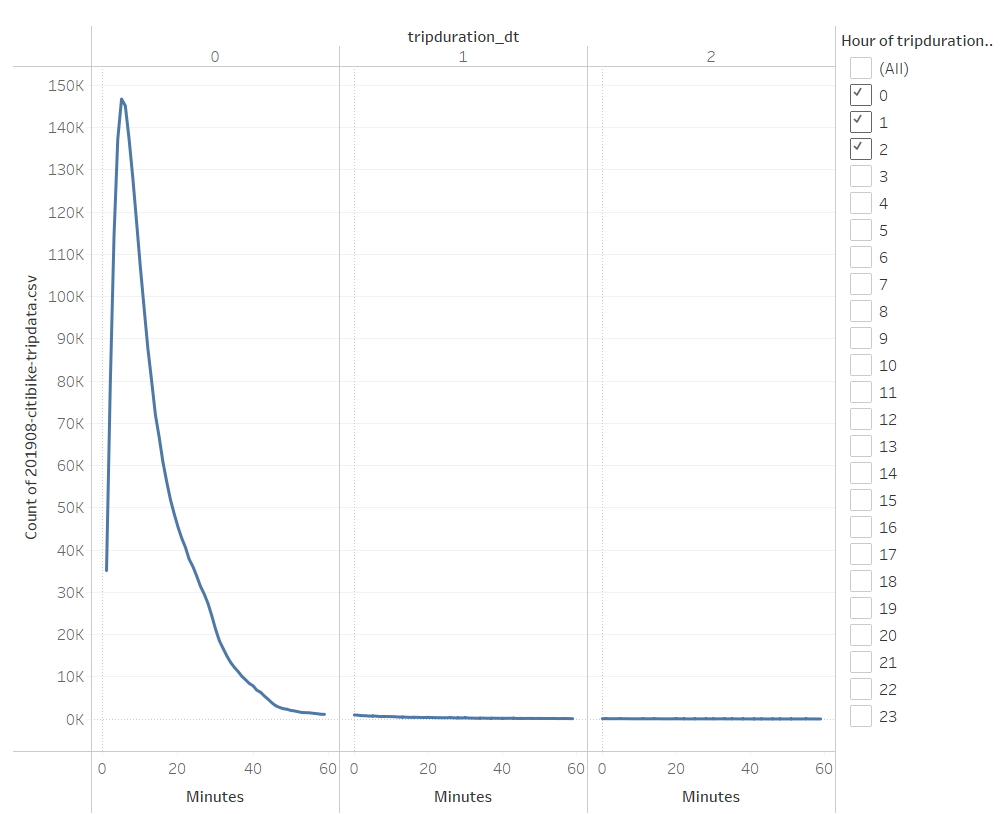
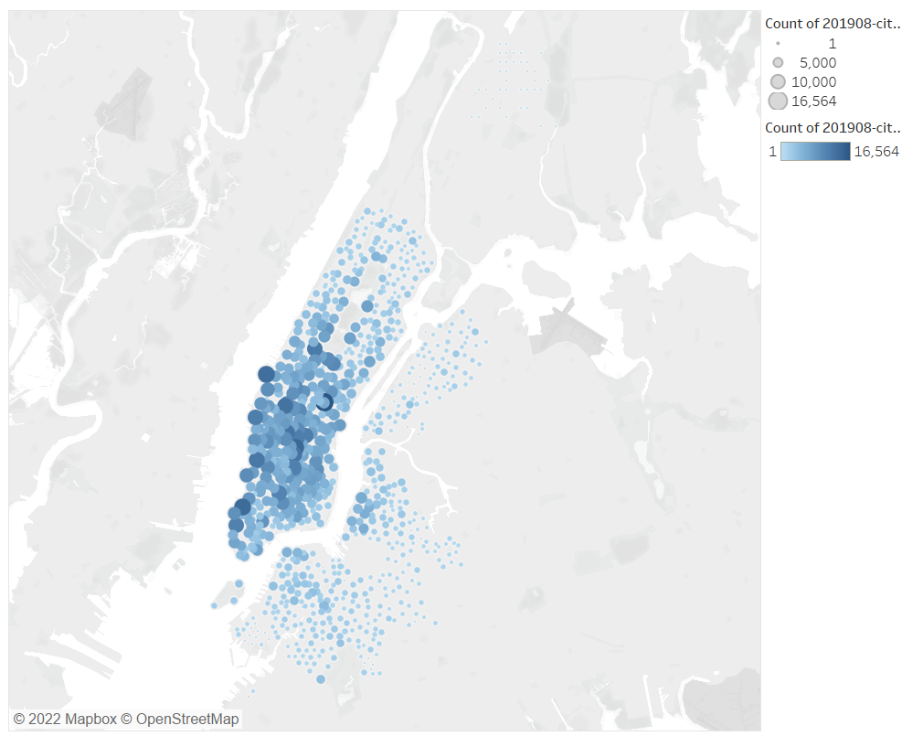
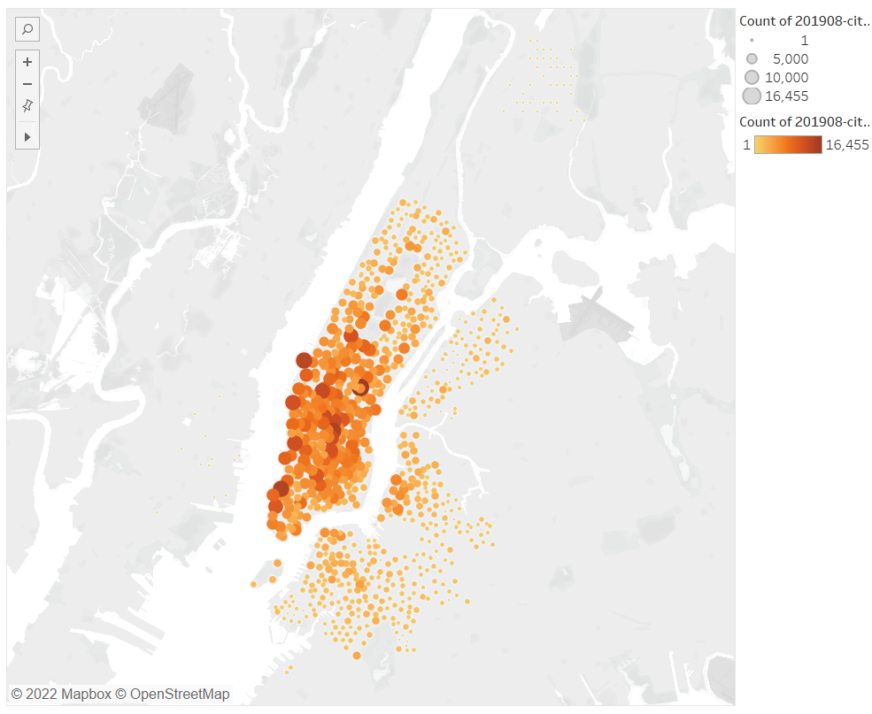
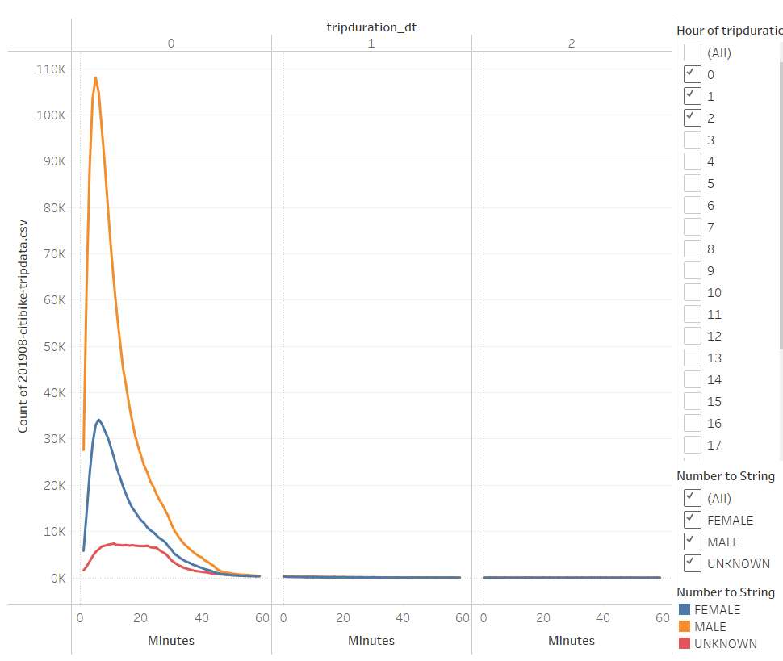
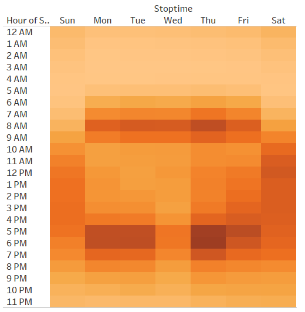
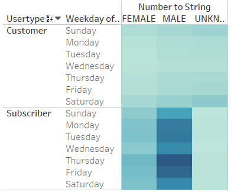

# NYC Citibike Analysis

[link to dashboard](https://public.tableau.com/app/profile/leonid.tkach/viz/module_14/NYCCitibikeAnalysis?publish=yes "link to dashboard")

**The data is from a period before COVID, so the analysis and recommendations below are for the pre-COVID world.**

## The Purpose
### What is this analysis for?

I do this analysis to gauge opportunities for bike sharing business in Des Moines. I use NYC Citibike experience as a benchmark. I am going to clarify NYC habits for starters to understand what should I do *if* my hometowners are like New Yorkers.

I provide you with my conclusions one by one.

## Checkout Times for Users
### For how long NYC customers ride shared bikes?

It's obvious from the picture below that most of them are just fooling around: they ride for less than ten minutes. If my future customers are like that, I should locate stations close to one another to enable them to feel satisfied with their "trips". Or they'll have to leave bikes at stations they started from, which may be disappointing. Top starting and ending locations are not in disagreement with the last notion.

Top Starting Locations|Top Ending Locations
---|---
|

## Checkout Times by Gender
### Does grouping by gender provide me with any extra information?

When I aggregate checkout times by gender, the picture gets more complicated. It turns out that customers who prefer not to convey their gender ride much longer. Most of them use they bikes for 10 to 30 minutes. Possible they love riding so much that they don't want to waste their time on ticking forms*. I'll have to try to estimate how many of my potential customers have similar approach to forms.

It's also possible that NYC Citibike not attractive enough for female customers. It may be due to something with the bikes. I should look into different bike models' popularity by gender and opt for the right model for my company.

\* That is the best explanation. See "Trips by Weekday per Hour".

## Trips by Weekday per Hour
### At what hours on what weekdays do customers use bike most intensively?

I see that I should do all the maintenance from 10-12AM on Monday-Wednesday, at least if my hometowners' habits are similar to those of New Yorkers. There are even "better" hours from 11PM-6AM, but it would definitely make my employees unhappy, and I don't want that.

## Trips by Gender (Weekday per Hour)
### Do genders tell me anything new about bike use per weekday?

It doesn't seem to be about gender at all. Customers not specifying their gender use bikes mostly on weekends, which means they are probably just in a happy weekend hurry to enjoy their ride. I mean their long weekend ride (see "Checkout Times by Gender" above).

That means that weekday customers use bikes to save time/have short exercise in weekday mornings and evenings. I could suppose they ride from a metro station to their office, that's why their rides are so short.

.png)

## Subscrivers' and Non-Subscribers' Trips by Gender by Weekday
### Is there any difference between them besides subscription?

There is. Subscribers use bikes only on weekdays. I should build station near business centers and metro stations for them. They definitely use bike to get to their job and back.

## High-Level Summary Extra Visualizations
### So what should I start with?

NYC Citibike experience tells me to start with the following:

- Build bike stations near business centers and metro stations for weekday customers using bike to get to work.
- Build bike stations near weekend attractions for weekend customers to conveniently enjoy their ride.
- Explore bike models by gender/popularity to try not to lose female customers like they did in NYC.
- Provide two subscriptions, one for weekdays and one for weekends:
   - Weekday subscription is for a period (month/year). Customers using bikes to ride to their offices do it 5 days a week, four weeks a month.
   - Weekend subscription is for rides (4/8/12 rides). Customers using bikes to fool around on weekend may not know in advance when exactly they are going to be in the right mood. I could require to use 4 rides in 1.5 months, 8 rides in 3 months and so on.

### My propositions for visualizations

- Aggregate trips by distance between starting and ending stations and by weekdays/weekend.
- Aggregate trips by distance between starting and ending stations and by hour.

The new visualizations will provide me with extra info on difference between habits of weekday customers (supposedly shorter trips on weekday mornings and evenings) and weekend customers (supposedly longer trips in the afternoon on weekends).
